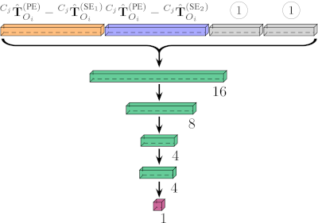

# Train a Network to Predict Grasp Success

Section III-C of our paper describes how pose estimates and grasping-trial outcomes are used to train success-prediction networks. We tried four training configurations:

- One network to predict for a single object and a single gripper (MLP in Table 3)
- One network to predict for all objects and a single gripper (MLP-O)
- One network to predict for a single object and all grippers (MLP-G)
- One network to predict for all objects and all grippers (MLP-OG)

In this repository, the code for each of these training configurations, respectively, is found in:
- 1Obj1Grip
- NObj1Grip
- 1ObjNGrip
- NObjNGrip

The basic network structure remains the same, and only input layers are changed according to the training configuration, as illustrated below.

